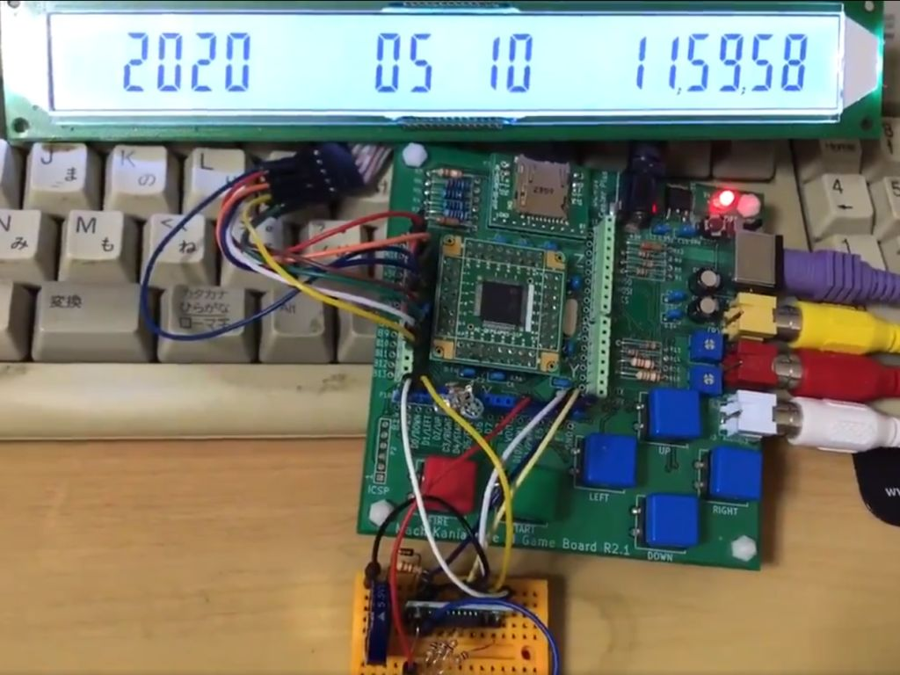

# セグメント液晶 LH02813B-TDC-1
aitendoの2020年正月の福袋に入っていたLH02813B-TDC-1をMachiKania type Mで動作させました。  
秋月電子のRTCモジュールAE-RTC-4543SA-V2と組み合わせてカレンダー時計として利用できます。  

## ピンアサイン
1  CS --- B8  
2  RD --- B9  
3  WR --- B10  
4  DATA - B11  
5  GND  
6  VDD (+3.3V)  
7  ?  
8  LED+ (+3.3V)  
9  LED- (GND)  
10 NC(?)  

## 参考サイト
アマチュア無銭家のブログ  
https://amateur-radio.cocolog-nifty.com/blog/2020/04/post-3c0699.html  
  
工作魂さんによるMachiKania type M用AE-RTC-4543SA-V2のクラスライブラリ  
https://github.com/kosaku-damashii/MachiKania-RTC  
  
秋月電子AE-RTC-4543SA-V2  
http://akizukidenshi.com/catalog/g/gK-10722/
